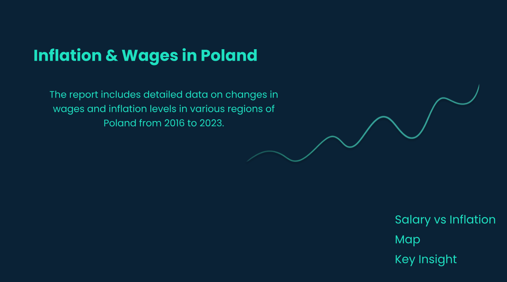
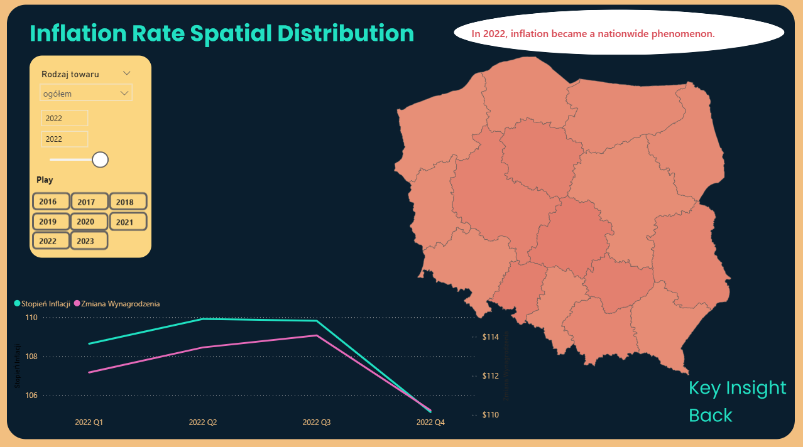

# Inflation-Wages_in_Poland
Inflation isn’t just a number — it’s a story that unfolds over time. I built an interactive dashboard exploring inflation dynamics in Poland (2016–2023) and how they relate to wage changes across regions. 

## Dashboard Main Page

## Inflation VS Wages
.png)

## Regional Map

