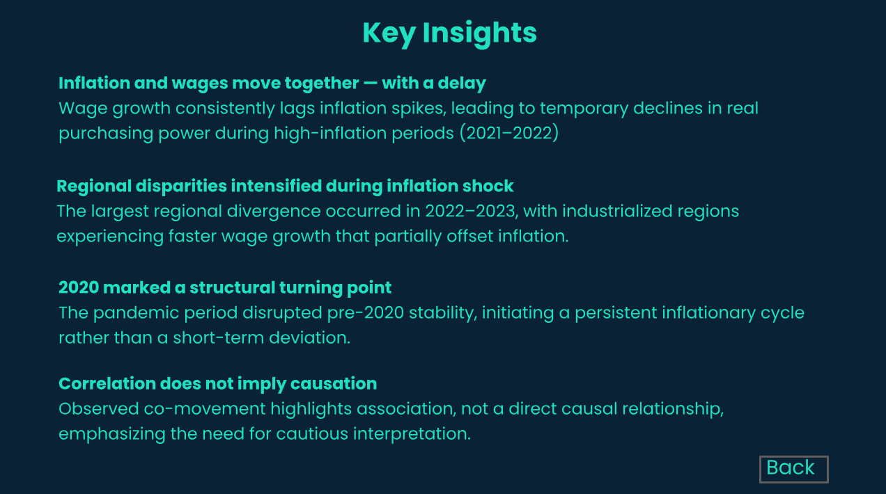

# Inflation-Wages_in_Poland
Inflation isn’t just a number — it’s a story that unfolds over time. I built an interactive dashboard exploring inflation dynamics in Poland (2016–2023) and how they relate to wage changes across regions. 

## Dashboard_Main_Page

## Inflation_vs_Wages
.png)

## Regional Map

## Key_Insight

## Live Interactive Dashboard
👉 [View interactive Power BI dashboard](https://app.powerbi.com/view?r=eyJrIjoiZWI0OTQ4YjktMTQxZi00ZTc3LTlkMmMtYWVjZjA5ZDdjMDdiIiwidCI6IjNkZmU5YWI2LTgxYmYtNDkxYy1iNjcwLTAxYzgyNGEwOWUxOSJ9)
